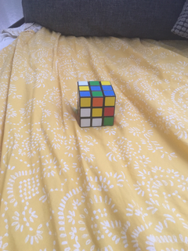

# Flash-To-Ambient Model

In the process of generating digital images from scenes sometimes the level of light is very low and insufficient to get a properly digitization of the image. Thus, noisy and blurry areas are produced in the image. We can handle this situation with an external illumination device such as a camera flash, but here is when other challenges are generated. The camera flash can be blinding and too strong for a scene, so instead of enhancing the low light image, sometimes, it causes very bright and very dark areas. Another problem in the flash image is the shadows. These shadows sometimes cover considerable areas of the scene depending on the direction of the camera flash. And finally, getting the correct tone of the scene objects in a flash image becomes very difficult, because the color of objects changes due to the flash illumination. In contrast, in an ambient image, the illumination of the objects not depends so much of their position, because the available light can be more evenly distributed.


The architecture has two CNNs, the generator, generates synthetic ambient images, and the discriminator network classifies if their input images are authentic. The generator network has as an encoder part all the convolutional layers of the [VGG-16](https://arxiv.org/abs/1409.1556) architecture pre-trained on ImageNet, and decoder part is a simetric respect to the encoder. The generator models the translation from flash images to synthetic ambient images. Ambient images from the training set is classified by the discriminator as a real, while the synthetic ambient image is classified by the discriminator as a fake. The discriminator is based on Isola et al. in the [pix2pix](https://arxiv.org/abs/1611.07004) framework.

## Qualitative results

| Flash image | Synthetic ambient image | Ambient image |
|:---:|:---:|:---:|
||||
||||
||||
||||
||||
||||

Figure 1. Some results of our model based on the pix2pix framework. Flash images (left), images generated through the generator network (middle) and the ground truth, the ambient image(right).

## Prerequisites

* Linux 
* Python 3.6.8
* PyTorch 1.2.0
* NVIDIA GPU + CUDA CuDNN

## Getting started

### Installation

* Clone this repo

```
git clone https://github.com/jozech/flash-to-ambient.git
cd flash-to-ambient
```
* Download the dataset

```
python3 download_database.py
```

If you have problems with the script above, you can download it [here](https://drive.google.com/open?id=1Z7Wy9Hj5HjVD8P-zVkw55_BISQ7jQSFg), then click on the download button. If you use the external URL, you have to put the *'DATASET_LR'* folder inside a directory called *'datasets'*. The dataset is a reduced set of [FAID](http://yaksoy.github.io/faid/) because in the entire FAID there are ambient images with low illumination, artifacts, etc. All images was reduced to 320x240 resolution for our experiments.

    ├─ flash-to-ambient/
       ├─ datasets/
            ├─ DATASET_LR/ 
       ├─ train.py
       ├─ test.py
       ├─ download_database.py
       ├─ imgs/
       ├─ models/
       ├─ tools/
       └─ options/

* You can generate the results for the test dataset, for 1000 epochs of training.
```
python3 download_model.py
python3 test.py --load_epoch=1000
```

* Train our model, with default hyperparameters.
```
python3 train.py
```

* Train our model, and save the model every 50 epochs.
```
python3 train.py --save_epoch=50
```
If you want to know more about the hyperparameters, see *options/base.py*.

### Acknowledgements

Some parts of our code are inspired by [pytorch-CycleGAN-and-pix2pix](https://github.com/junyanz/pytorch-CycleGAN-and-pix2pix).

