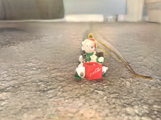

# Flash-To-Ambient Model

In the procces of generating digital images from scences sometimes the level of light very low and insufficient to get a properly digitization of the image. Thus, noisy and blurry areas are produced in the image. We can handle this situation with an external illumination device such as a camera flash, but here is when other challenges are generated. The camera flash can be blinding and too strong for a scene, so instead of enhancing the low light image, sometimes, it causes very bright and very dark areas. Another problem in the flash image is the shadows. These shadows sometimes cover considerable areas of the scene depending on the direction of the camera flash. And finally, getting the correct tone of the scene objects in a flash image becomes very difficult, because the color of objects changes due the flash illumination. In contrast, in an ambient image, the illumination of the objects not depends so much of their position, because the available light can be more evenly distributed.

The architecture has two CNNs, the generator, generates synthetic ambient images, and the discriminator network classifies if their input images are authentic. The generator network has as an encoder the [VGG-16](https://arxiv.org/abs/1409.1556). The generator models the translation from flash images($I_f$) to ambient images($\hat{I}_a$). The real image($I_a$) is classified by the discriminator as a real, while the synthetic image($\hat{I}_a$) is classified by the discriminator as a fake. The discriminator is the same proposed by [Isola et al.](https://arxiv.org/abs/1611.07004)(pix2pix).

## Qualitative results

  